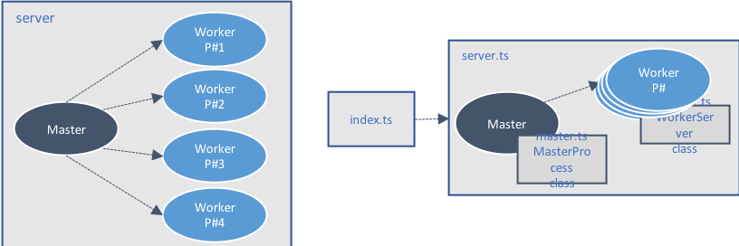

# Starter Kit

Basically the application is composed of 4 files : 

* **index.ts** - entry point of the application
    * It just creates the `Server` (from the `server.ts`).
    * a boolean (`true`) can be passed as argument on the command line to enable the cluster mode. This can be used if you want to use the same code for testing node clustering with `PM2`. The default (if not specified) is `true`.

* **server.js** - server implementation.
    * Based on the `cluster.isMaster` property value, it creates a `MasterProcess` (from `master.ts`) or a `WorkerProcess` from (`worker.ts`))

* **master.ts** - implementation of the Node.js cluster master process.
    * It forks the worker processes (1 / CPU core)
    * It maintains all the Worker references in cache
    * It subscribes to the `online` event, raised when a worker is online
    * It subscribes to the `exit` event, raised when a worker crashes. It react on this by forking a new worker.

* **worker.ts** - implementation of the Node.js cluster worker process
    * Starts the `Express` web application and listens for incoming HTTP requests
    * Provides a middleware to log on the console the HTTP incoming HTTP request
    * Exposes a `/` route to serve static files from a root folder. It uses also extra middlewares like `cors`, `body parser`, ...)
    * Handle the 404 (Not found)
    * Provide a `/ping` route (GET) that returns some data 





> This code can be downloaded from the **starter-kit** branch

## Installation

```bash
git clone https://github.com/node-techno-lab/node-cluster.git
git checkout starter-kit
npm install
```

## Compile the application

```bash
npm run build       // compile the application
npm run build:watch // compile the application in watch mode
```

## Start the application

> The machine where the tests have been executed contains 8 CPU cores.

```bash
npm run start       // start the application 
```

This should produce the following output on the console

```text
Cluster master 15732...
Master forks a Cluster Worker
Master cache contains now 1 cluster worker(s) [15733]
Master forks a Cluster Worker
Master cache contains now 2 cluster worker(s) [15733, 15734]
Master forks a Cluster Worker
Master cache contains now 3 cluster worker(s) [15733, 15734, 15735]
Master forks a Cluster Worker
Master cache contains now 4 cluster worker(s) [15733, 15734, 15735, 15736]
Master forks a Cluster Worker
Master cache contains now 5 cluster worker(s) [15733, 15734, 15735, 15736, 15737]
Master forks a Cluster Worker
Master cache contains now 6 cluster worker(s) [15733, 15734, 15735, 15736, 15737, 15738]
Master forks a Cluster Worker
Master cache contains now 7 cluster worker(s) [15733, 15734, 15735, 15736, 15737, 15738, 15739]
Master forks a Cluster Worker
Master cache contains now 8 cluster worker(s) [15733, 15734, 15735, 15736, 15737, 15738, 15739, 15740]
Worker-15734 is online...
Worker-15733 is online...
Worker-15735 is online...
Worker-15736 is online...
Worker-15740 is online...
Worker-15739 is online...
Worker-15738 is online...
Worker-15737 is online...
Worker:15733 Web app is listening on port: 3030
Worker:15735 Web app is listening on port: 3030
Worker:15736 Web app is listening on port: 3030
Worker:15734 Web app is listening on port: 3030
Worker:15740 Web app is listening on port: 3030
Worker:15739 Web app is listening on port: 3030
Worker:15738 Web app is listening on port: 3030
Worker:15737 Web app is listening on port: 3030
```

## Call the /ping route
Call the `/ping` route, by using `curl` 

```bash
curl localhost:3030/ping
```

This should produce the following output on the consoles

```text
// Client logs
Worker:15734 is responding

// Server logs
Worker:15734 Request - GET => /ping
```

## Kill a worker process

Get the list of running worker processes 

```bash
pgrep -lf node-cluster/dist/index.js
```

This should produce the following output on the console

```bash
15726 sh -c npm run build && node ./dist/index.js true
15732 node ./dist/index.js true
15733 /usr/local/bin/node /Users/id082816/Dev/github/node-techno-lab/node-cluster/dist/index.js true
15734 /usr/local/bin/node /Users/id082816/Dev/github/node-techno-lab/node-cluster/dist/index.js true
15735 /usr/local/bin/node /Users/id082816/Dev/github/node-techno-lab/node-cluster/dist/index.js true
15736 /usr/local/bin/node /Users/id082816/Dev/github/node-techno-lab/node-cluster/dist/index.js true
15737 /usr/local/bin/node /Users/id082816/Dev/github/node-techno-lab/node-cluster/dist/index.js true
15738 /usr/local/bin/node /Users/id082816/Dev/github/node-techno-lab/node-cluster/dist/index.js true
15739 /usr/local/bin/node /Users/id082816/Dev/github/node-techno-lab/node-cluster/dist/index.js true
15740 /usr/local/bin/node /Users/id082816/Dev/github/node-techno-lab/node-cluster/dist/index.js true
```

Kill a running worker process by using its PID

```bash
killl  15740
```

This should produce the following output on the consoles

```text
// Server logs
Worker-15740 stopped working after 1330.543 sec (code:null, signal:SIGTERM exitedAfterDisconnect:false).
Master forks a Cluster Worker
Master cache contains now 8 cluster worker(s) [15733, 15734, 15735, 15736, 15737, 15738, 15739, 16901]
Worker-16901 is online...
Worker:16901 Web app is listening on port: 3030
```

## Call the / route

Call the `/` route, by using `curl` or the browser. This will send the `public\index.html` to the client.

```bash
curl localhost:3030/
```

This should produce the following output on the consoles

```text
// Client logs
<!doctype html>

<html lang="en">
<head>
  <meta charset="utf-8">

  <title>HTML5 Web App</title>
  <meta name="description" content="HTML5 Web app">
  <link rel="stylesheet" href="/css/style.css">
</head>

<body>
  <script src="js/scripts.js"></script>
  <h1>HTML 5 Web app</h1>
</body>

// Server logs
Worker:15738 Request - GET => /
```